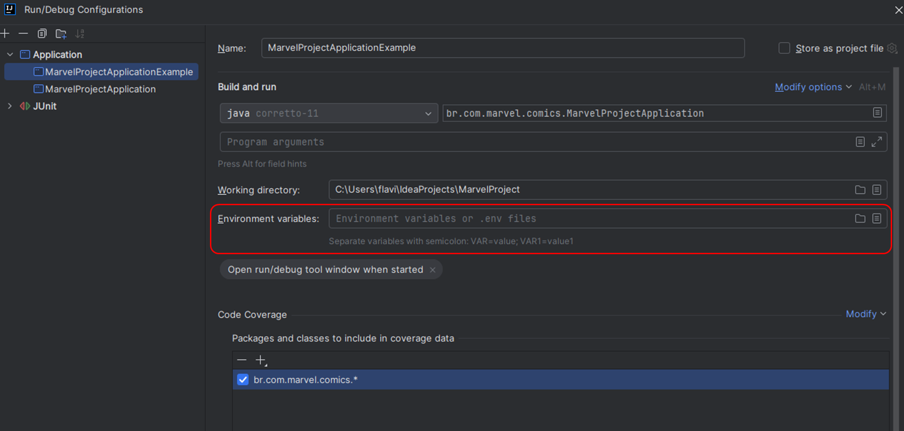

# Marvel Project

Welcome to my project Marvel. Its purpose is to be a portfolio of my hard skills with Java+Spring.
So, lets go and see it!

## Study Case

With this project I want to test what I have studying about architecture and clean code
and try to create different approaches to write a Java+Spring project.

Below there is a list of **branches** that I want to provide at the end of the project:

+ [ ] ***package-by-layer***: Common layered organization of packages with **controllers**, **services**, **repositories** and/or **clients** packages.
+ [ ] ***clean-architecture***: Packages split between the **application** core business, the **domain** entities and **infra** resources.

## The challenge

My friends are searching for a job role as Junior Software Developer in Brazil,
and one of their tests is described in the file
[technical_challenge_marvel.md](technical_challenge_marvel.md).

## Authentication

First you will need to create your profile in the [https://developer.marvel.com/]("https://developer.marvel.com/").
After that, you will receive a Public Key and a Private Key. You are going to need both in order to execute this project.

Since the Public and Private keys are unique and represents your "login" for the Marvel Developer Portal, you should not
share their values. Then, it is highly recommended you use Environment Variables to set them up to the project.

You can configure Env Variables in more than one way:
+ You can set their values in your own Operating System, witch is more reliable.
+ Or, if you are using IntelliJ, you can simply add their values (or an .env file) in your [Run/Debug Configuration]("https://www.baeldung.com/intellij-idea-environment-variables").

After you do that, the application will be able to execute authenticated requests to the Marvel Api.
